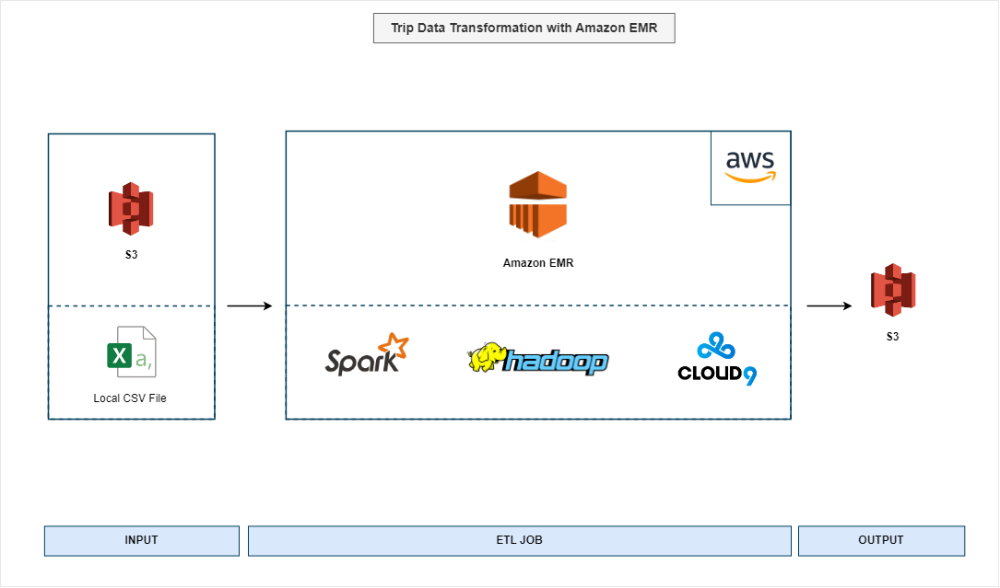

# Trip Data Transformation with Amazon EMR

## Project Description

**Objective/Goal**:
- Transform trip data using Apache Spark on Amazon EMR.

**Sector**:
- Transportation

**Technologies Used**:
- Apache Spark, Amazon EMR, AWS Cloud9, Hadoop, AWS S3. Jobs are submitted via CLI through Cloud9 and EMR steps.

## Data Source, Transformation & Output

**Architecture Overview**:
- The project utilizes a distributed processing architecture with AWS services including EMR for Spark processing, S3 for storage, and Cloud9 as a development environment.
- 

**Data Sources**:
- Data is sourced from CSV files stored in an AWS S3 bucket.

**Transformation Steps**:
- The ETL process is driven by a script ([spark-etl.py](./spark-etl.py)).
- Read data from the S3 bucket using Spark's CSV reader with schema inference enabled.
- Apply necessary data transformations as defined in the ETL script.
- Write the transformed data back to S3 as Parquet files for optimized storage and access.

**Output**:
- The transformed data is stored back into an AWS S3 bucket in Parquet format.

## Job Submission & Tracking

- **Terminal Submission**: Overview of job submission via AWS Cloud9 terminal.
  
- **EMR Step Submission**: Detailed view of job submission using EMR Step.
  
- **Spark UI**: Monitoring the Spark job through EMR Spark UI.
  
- **Hadoop UI**: Tracking job progress using the Hadoop UI.
  

## Results

- The successful transformation of trip data allows for more efficient querying and can support more complex analytical tasks.

## Learnings

- Gained insights into configuring and managing AWS EMR clusters, automating data pipelines, and optimizing Spark jobs for performance.
